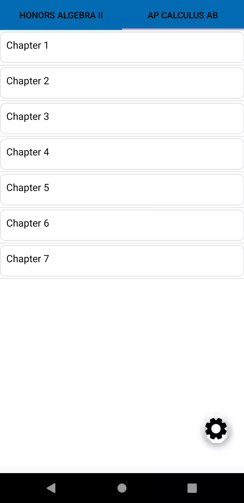
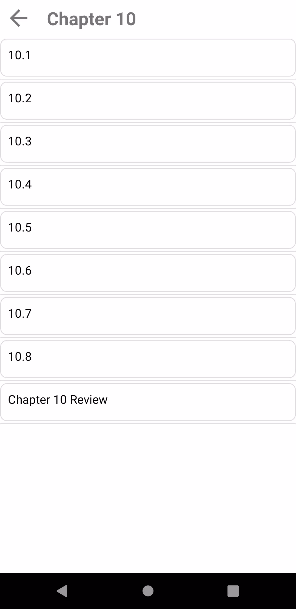
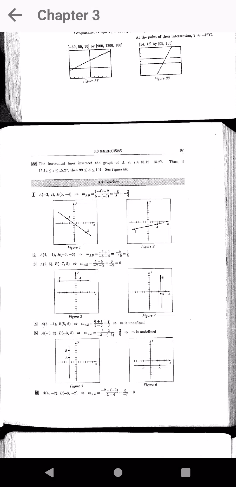
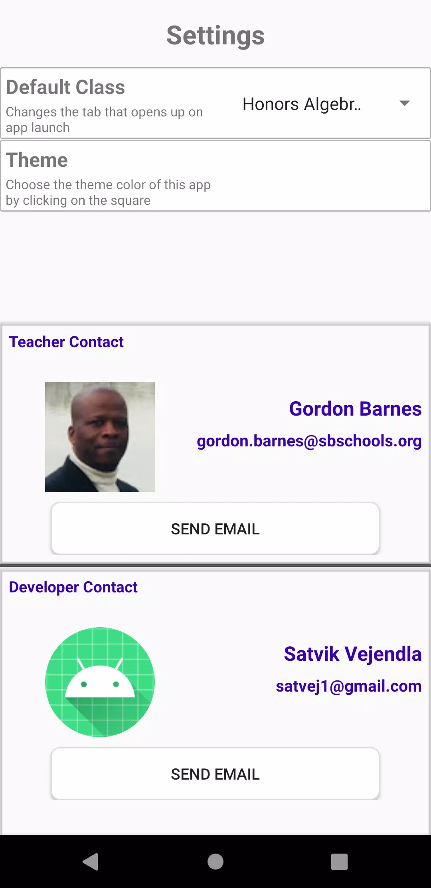

# Barnes Workspace App

Note: This project was created in Dec 2020. This was once published to Google Play Store but the app has been discontinued due to lack of updates.

An app for Honors Algebra II students and AP Calculus AB students to view the solutions to their homework problems.

- Customizable user theme
- Direct access to solutions

